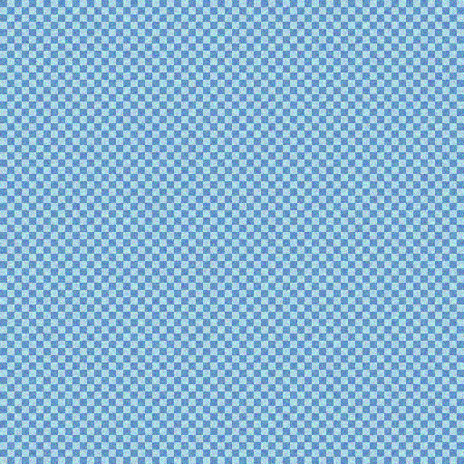
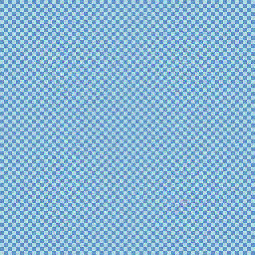
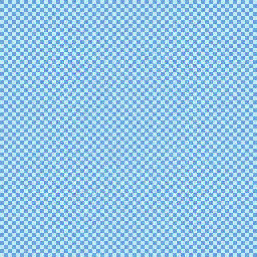
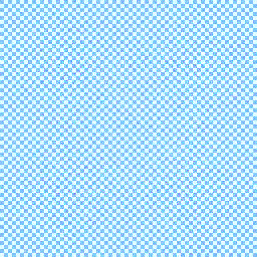

# 图像修复对话测试报告

**测试时间**: 2025-09-29T13:56:11.958650
**总轮次**: 3
**最终修复日志**: ['jpeg compression artifact', 'motion blur', 'haze']

## 原始图片

## 对话过程

### 轮次 1

**思考过程**: The image shows noticeable 8x8 blockiness and ringing artifacts, especially in flat areas. According to the restoration principle, compression artifacts are Priority 1 and must be fixed first.

**工具调用**: `swinir_jpeg_artifact_removal`
**参数**: `{'jpeg': 40}`

**工具回复**: Successfully removed JPEG compression artifacts. Blockiness reduced significantly.

**处理后图片**:

---

### 轮次 2

**思考过程**: The compression artifacts are gone, but a clear directional blur is now visible, indicating camera shake. This is an imaging degradation (Priority 2) and is now the most critical issue.

**工具调用**: `xrestormer_motion_deblurring`
**参数**: `{'strength': 0.8}`

**工具回复**: Motion blur correction applied. Image sharpness improved.

**处理后图片**:

---

### 轮次 3

**思考过程**: Motion blur has been addressed, but the image still appears hazy with reduced contrast and visibility. This is a scene degradation (Priority 3) that needs to be fixed.

**工具调用**: `dehazeformer_dehaze`
**参数**: `{'strength': 0.7}`

**工具回复**: Haze removal completed. Visibility and contrast enhanced.

**处理后图片**:

---

## 总结

本次测试成功模拟了完整的图像修复对话流程，包括：
1. 模型推理和输出解析
2. 工具调用和执行
3. 图像处理和保存
4. 对话历史记录

所有结果文件保存在: `test_results/`
